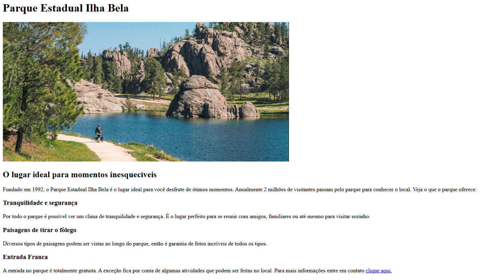
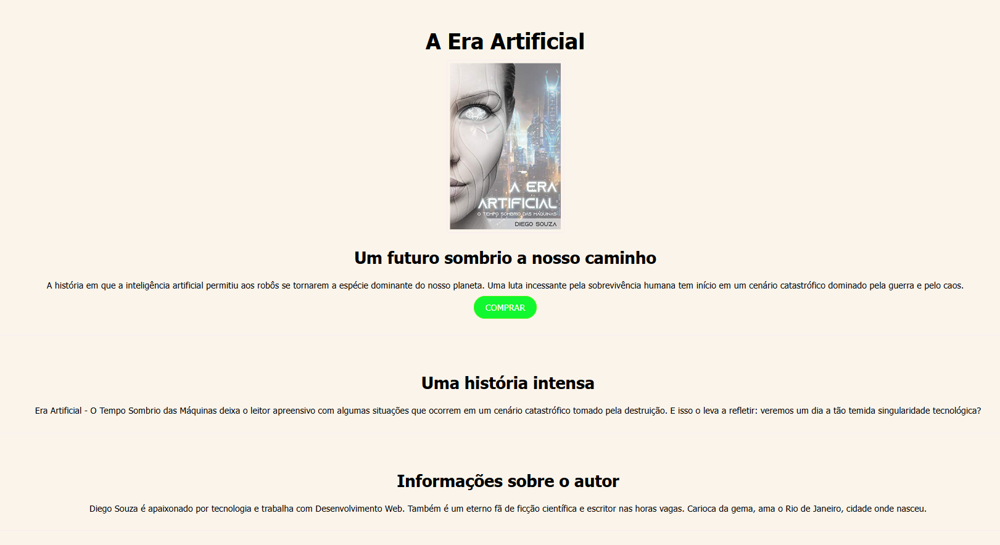
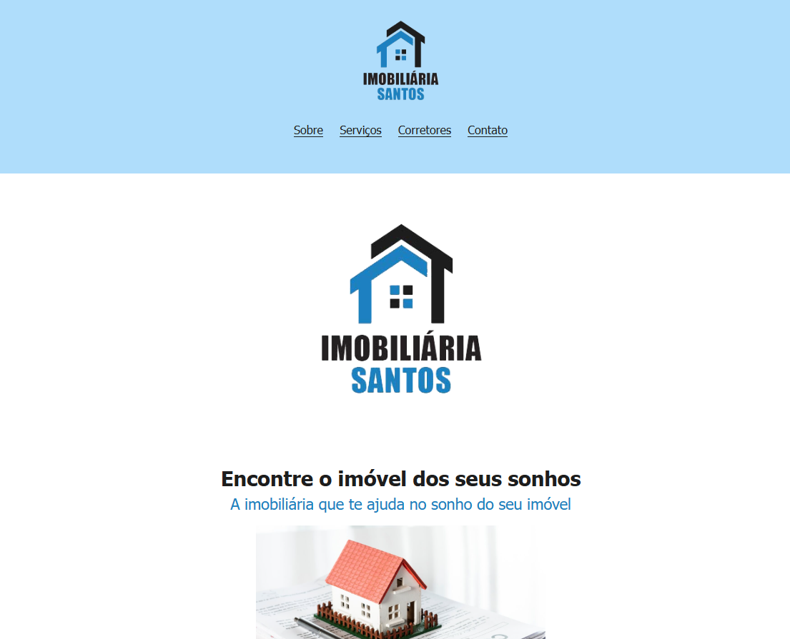
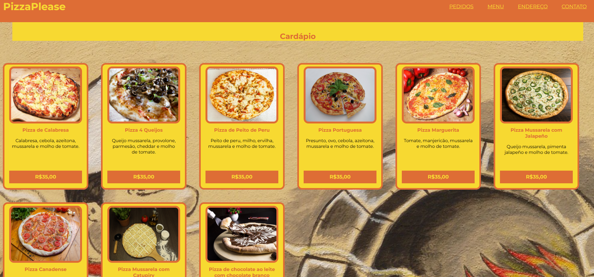

# Projetos de Aprendizado em HTML/CSS

Este repositório contém projetos criados durante meu aprendizado de HTML e CSS. A cada projeto, exploro novos conceitos e técnicas para aprimorar meu entendimento sobre desenvolvimento web.

## Projetos

---

### Site estático Ilha Bela.&nbsp;

## 

---

### Site estático A era artifícial.&nbsp;

## 

---

### Site estático Imobiliária Santos.&nbsp;

## 

---

### Site estático de uma Pizzaria aprendendo o uso de cards no site.&nbsp;

## 

---

### Login Landing Page.

## 

---
